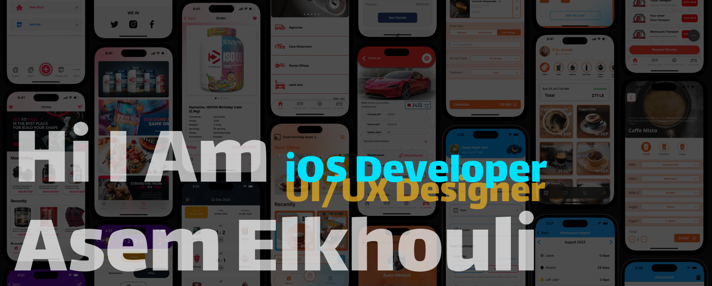

  

  ### Asem Elkhouli

  

    I'm iOS developer and UI/UX Designer from Dammam, The Eastern Region, KSA working in iOS development.
  
    I enjoy turning complex problems into simple, beautiful and intuitive designs.
  

### iOS Applications

    
     
     
    
    
    
    
    

### UI/UX design

    
    
    
    

  

  
  
  
   

<!--
**asemelkhouli20/asemelkhouli20** is a ✨ _special_ ✨ repository because its `README.md` (this file) appears on your GitHub profile.

Here are some ideas to get you started:

- 🔭 I’m currently working on ...
- 🌱 I’m currently learning ...
- 👯 I’m looking to collaborate on ...
- 🤔 I’m looking for help with ...
- 💬 Ask me about ...
- 📫 How to reach me: ...
- 😄 Pronouns: ...
- ⚡ Fun fact: ...
-->
